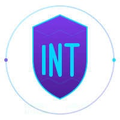

<div align="center">



# INTcoin (INT)

**Quantum-Resistant • ASIC-Resistant • Decentralized**

*The Future of Secure Currency*

[](https://opensource.org/licenses/MIT)
[](https://en.cppreference.com/w/cpp/23)
[](https://www.python.org/)
[](https://gitlab.com/intcoin/crypto)
[](https://csrc.nist.gov/projects/post-quantum-cryptography)
[](https://pq-crystals.org/dilithium/)
[](https://pq-crystals.org/kyber/)
[](docs/LIGHTNING.md)

---

</div>

## 🌟 Overview

INTcoin is a next-generation cryptocurrency designed from the ground up to be resistant to both quantum computing attacks and ASIC mining centralization. Built with privacy, decentralization, and long-term security as core principles.

> **🔮 The Quantum Threat is Real**: Quantum computers will break Bitcoin's ECDSA signatures within the next decade. INTcoin uses NIST-standardized post-quantum cryptography to protect your funds today and tomorrow.

### Key Features

- ✅ **Quantum-Resistant Cryptography**: CRYSTALS-Dilithium5 and Kyber1024 (NIST Level 5 post-quantum algorithms)
- ✅ **ASIC-Resistant Mining**: SHA-256 PoW (becomes ASIC-resistant in quantum era)
- ✅ **Privacy-Focused**: Pseudonymous transactions by default
- ✅ **HD Wallet**: BIP39 mnemonic phrases with hierarchical deterministic key generation
- ✅ **Multi-threaded CPU Miner**: Optimized SHA-256 mining with auto-thread detection
- ✅ **P2P Network**: Distributed peer-to-peer networking
- ✅ **Transaction Mempool**: Fee-based transaction prioritization
- ✅ **Qt GUI Wallet**: Professional cross-platform graphical interface
- ✅ **JSON-RPC API**: Complete remote control capabilities
- ✅ **Lightning Network**: Fast, low-cost Layer 2 payment channels
- ✅ **Smart Contracts**: Secure VM with gas metering and SafeMath
- ✅ **Cross-Chain Bridges**: Atomic swaps with Bitcoin and Ethereum
- ✅ **TOR Support**: Anonymous networking with hidden service capability
- ✅ **Merkle Tree Structure**: SHA3-256 based efficient transaction verification
- ✅ **Pure PoW**: No staking, governance, or centralization mechanisms
- ✅ **Mining Pool Support**: Stratum protocol V1 for pooled mining
- ✅ **Full P2P Network**: IBD, peer discovery, scoring, and SPV support

### 📊 Specifications

<table>
<tr>
<td>

**Network**
| Parameter | Value |
|-----------|-------|
| Ticker | INT |
| Change Unit | INTS |
| Max Supply | 221 Trillion INT |
| Block Time | ~5 minutes (300 seconds) |
| Consensus | Proof of Work (PoW) |
| Mining Algorithm | SHA-256 (quantum-era ASIC-resistant) |
| P2P Port | 9333 (mainnet), 18333 (testnet) |
| RPC Port | 9332 (mainnet), 18332 (testnet) |

</td>
<td>

**Cryptography**
| Parameter | Value |
|-----------|-------|
| Hash Function | SHA3-256 (Keccak) |
| Signature Scheme | CRYSTALS-Dilithium5 |
| Key Exchange | CRYSTALS-Kyber1024 |
| Security Level | NIST Level 5 |
| Address Format | Base58Check |

</td>
</tr>
<tr>
<td colspan="2">

**Emission Schedule**
| Parameter | Value |
|-----------|-------|
| Initial Reward | 105,113,636 INT |
| Halving Method | 50% every 4 years |
| Halving Interval | 1,051,200 blocks (~4 years) |
| Total Emission Period | ~256 years (64 halvings) |

</td>
</tr>
</table>

## 🌐 Project Information

<div align="center">

**Website**: [international-coin.org](https://international-coin.org) |
**Documentation**: [Docs](https://international-coin.org/docs/) |
**Whitepaper**: [HTML](https://international-coin.org/docs/whitepaper.html) | [PDF](https://international-coin.org/docs/whitepaper.pdf)

**Repository**: [gitlab.com/intcoin/crypto](https://gitlab.com/intcoin/crypto) |
**Wiki**: [Technical Docs](https://gitlab.com/intcoin/crypto/-/wikis/home)

**Lead Developer**: Maddison Lane | **License**: MIT

### 📧 Contact

| Purpose | Email | GPG Key |
|---------|-------|---------|
| General | team@international-coin.org | `85A2 19E7 98EE E017 2669 450B E7FC C378 2A41 8E33` |
| Security | security@international-coin.org | `50FA 6D8F 2359 DBD9 3BA7 6263 1916 8ED3 FF91 FF72` |
| Admin | admin@international-coin.org | `6E68 20D6 0277 879B 3EFA 62D1 EB1A 8F24 AB19 0CBC` |

</div>

## Building from Source

### Prerequisites

#### macOS
```bash
brew install cmake boost openssl qt@5 python3
```

#### Linux (Ubuntu/Debian)
```bash
sudo apt-get update
sudo apt-get install build-essential cmake libboost-all-dev libssl-dev \
    qtbase5-dev qttools5-dev libqt5svg5-dev python3 python3-pip
```

#### FreeBSD
```bash
pkg install cmake boost-all openssl qt5 python3
```

#### Windows
- Install Visual Studio 2022 or later
- Install CMake 3.20+
- Install vcpkg and dependencies:
```powershell
vcpkg install boost openssl qt5
```

### Build Instructions

#### Quick Build (Automated Scripts)

**Linux:**
```bash
git clone https://gitlab.com/intcoin/crypto.git
cd crypto
./build-linux.sh          # Standard release build
./build-linux.sh --help   # See all options
```

**FreeBSD:**
```bash
git clone https://gitlab.com/intcoin/crypto.git
cd crypto
./build-freebsd.sh        # Standard release build
./build-freebsd.sh --help # See all options
```

**Windows (PowerShell):**
```powershell
git clone https://gitlab.com/intcoin/crypto.git
cd crypto
.\build-windows.ps1               # Standard release build
.\build-windows.ps1 -WithInstaller # Build with installer
```

#### Manual Build

```bash
# Clone the repository
git clone https://gitlab.com/intcoin/crypto.git
cd crypto

# Create build directory
mkdir build && cd build

# Configure
cmake .. -DCMAKE_BUILD_TYPE=Release

# Build
cmake --build . -j$(nproc)

# Install (optional)
sudo cmake --install .
```

### Installation Scripts

Automated installation scripts are available for various platforms:

**Linux:**
- Debian/Ubuntu: `./scripts/install-debian.sh`
- Fedora/RHEL: `./scripts/install-fedora.sh`
- Arch Linux: `./scripts/install-arch.sh`

**FreeBSD:**
- `./scripts/install-freebsd.sh`

**Windows:**
- PowerShell installer: `.\scripts\install-windows.ps1`

For detailed platform-specific instructions, see:
- Windows: [docs/BUILD-WINDOWS.md](docs/BUILD-WINDOWS.md)
- Linux: [docs/INSTALL-LINUX.md](docs/INSTALL-LINUX.md)
- FreeBSD: [docs/INSTALL-FREEBSD.md](docs/INSTALL-FREEBSD.md)

### Build Options

```bash
# Disable Qt wallet
cmake .. -DBUILD_QT_WALLET=OFF

# Disable Lightning Network
cmake .. -DENABLE_LIGHTNING=OFF

# Build with tests
cmake .. -DBUILD_TESTS=ON
```

## Quick Start

### Running the GUI Wallet

```bash
# Start the Qt wallet
./build/intcoin-qt

# Or with specific data directory
./build/intcoin-qt --datadir=/path/to/data
```

### Running the Daemon

```bash
# Start the daemon
./build/intcoind

# Run in background
./build/intcoind --daemon

# Specify testnet
./build/intcoind --testnet
```

### Using the CLI

```bash
# Get blockchain info
./build/intcoin-cli getblockchaininfo

# Create new address
./build/intcoin-cli getnewaddress "My Address"

# Check balance
./build/intcoin-cli getbalance

# Send transaction
./build/intcoin-cli sendtoaddress "INT1..." 10.5

# Start mining
./build/intcoin-cli startmining 4

# Stop mining
./build/intcoin-cli stopmining
```

### First Time Setup

1. **Create a wallet**:
```bash
./build/intcoin-qt
# Click "File" > "New Wallet"
# Save your mnemonic phrase securely!
```

2. **Get your first address**:
```bash
./build/intcoin-cli getnewaddress "Main"
```

3. **Start mining** (testnet recommended):
```bash
./build/intcoin-cli --testnet startmining
```

## Running INTcoin

### Start the daemon
```bash
./intcoind
```

### Start with testnet
```bash
./intcoind -testnet
```

### Use the Qt wallet
```bash
./intcoin-qt
```

### Use the CLI
```bash
./intcoin-cli help
./intcoin-cli getblockchaininfo
./intcoin-cli getbalance
```

### CPU Mining
```bash
# Mine from wallet
./intcoin-qt  # Enable mining in GUI

# Or use standalone miner
./intcoin-miner -t 4  # Use 4 threads
```

## Advanced Features

### Lightning Network

INTcoin includes a fully-featured Lightning Network implementation for instant, low-cost transactions:

**Current Features:**
- Payment channels with HTLC support
- Multi-hop routing with onion encryption
- BOLT #11 invoice support
- Channel management (open, close, force-close)
- Real-time fee estimation

**Future Enhancements:**
- **Watchtowers**: Third-party monitoring services for channel security
- **Submarine Swaps**: Seamless on-chain ↔ off-chain conversions
- **Atomic Multi-Path Payments (AMP)**: Split large payments across multiple routes
- **Trampoline Routing**: Lightweight routing for mobile clients
- **Channel Factories**: Batch channel creation for efficiency
- **Splicing**: Dynamic channel capacity adjustments without closing
- **Dual-Funded Channels**: Both parties contribute to initial funding

See [src/lightning/README.md](src/lightning/README.md) for complete documentation.

### Smart Contracts

Secure virtual machine with comprehensive safety features:
- Gas metering to prevent infinite loops
- SafeMath for overflow protection
- Memory and stack safety
- ERC20-compatible token support
- Security analyzer for vulnerability detection

See [src/contracts/README.md](src/contracts/README.md) for contract development guide.

### Cross-Chain Bridges

Trustless atomic swaps with other blockchains:
- Bitcoin bridge with SPV proofs
- Ethereum bridge with smart contract integration
- Hash Time Locked Contracts (HTLC)
- Multi-signature security

See [src/bridge/README.md](src/bridge/README.md) for usage examples.

## Testing

```bash
# Run Python test suite
cd tests
python3 -m pytest

# Run C++ unit tests
./build/tests/intcoin-tests

# Run Lightning Network tests
./build/tests/test_lightning

# Run smart contract VM tests
./build/tests/test_contracts

# Run bridge tests
./build/tests/test_bridge
```

## Network Types

### Mainnet
Production network with real value.

### Testnet
Testing network with test coins (no real value).
```bash
./intcoind -testnet
```

## Documentation

See the [docs](docs/) directory for detailed documentation:

**Getting Started:**
- [Quick Start Guide](docs/QUICK-START.md) - Get started in minutes
- [Website Getting Started](https://international-coin.org/docs/getting-started.html) - Interactive web guide
- [Whitepaper](https://international-coin.org/docs/whitepaper.html) - Technical whitepaper (HTML)
- [Whitepaper PDF](https://international-coin.org/docs/whitepaper.pdf) - Download PDF version
- [Genesis Block](docs/GENESIS_BLOCK.md) - Official mainnet genesis block details
- [Project Status](PROJECT-STATUS.md) - Current development status

**Building & Installation:**
- [BUILD.md](BUILD.md) - Comprehensive build guide for all platforms
- [Windows Build](docs/BUILD-WINDOWS.md) - Detailed Windows build instructions
- [Linux Installation](docs/INSTALL-LINUX.md) - Linux build and install instructions
- [FreeBSD Installation](docs/INSTALL-FREEBSD.md) - FreeBSD build and install instructions

**Technical Documentation:**
- [Cryptography Design](docs/CRYPTOGRAPHY-DESIGN.md) - Quantum-resistant cryptography design
- [RPC API Reference](docs/RPC-API.md) - Complete JSON-RPC API documentation
- [Design Decisions](DESIGN-DECISIONS.md) - Architectural design decisions
- [Lightning Network](src/lightning/README.md) - Layer 2 payment channels
- [Smart Contracts](src/contracts/README.md) - Secure VM and contract development
- [Cross-Chain Bridges](src/bridge/README.md) - Atomic swaps with other chains
- [Mining Pools](src/pool/README.md) - Stratum protocol implementation

## Security

### Security Features Implemented

INTcoin implements comprehensive security measures throughout the codebase:

#### Core Security Framework (New)

- ✅ **Comprehensive Input Validation** ([include/intcoin/validation.h](include/intcoin/validation.h)):
  - String validation (length, charset, hex, base58, hostname patterns)
  - Numeric validation (range checks, amount validation, timestamp validation)
  - Binary validation (hash, pubkey, signature DER format)
  - Network validation (IPv4, IPv6, peer address)
  - Composite validators for transactions and blocks

- ✅ **Integer Overflow Protection** ([include/intcoin/safe_math.h](include/intcoin/safe_math.h)):
  - Safe arithmetic operations (add, sub, mul, div) with std::optional returns
  - Safe type casting with overflow detection
  - Saturation arithmetic (saturate at min/max instead of failing)
  - Checked arithmetic class (throws exceptions on overflow)
  - Cryptocurrency amount operations with MAX_SUPPLY enforcement
  - Utility macros for safe operations (SAFE_ADD_OR_RETURN, etc.)

- ✅ **Memory Safety** ([include/intcoin/memory_safety.h](include/intcoin/memory_safety.h)):
  - SafeBuffer: Bounds-checked byte arrays with capacity limits
  - SafeString: Overflow-safe string operations (strcpy, strcat, format)
  - SafeArray: Fixed-size arrays with bounds checking
  - BoundedVector: Vectors with maximum size limits
  - SecureMemory: RAII secure memory with automatic clearing
  - Constant-time operations (prevent timing attacks)
  - Stack guard for recursion depth protection
  - Memory alignment helpers

#### Previously Implemented Security

- ✅ **Serialization security**: Versioned format with size limits (4MB blocks, 1MB transactions, 32MB messages)
- ✅ **Wallet encryption**: AES-256-GCM authenticated encryption with constant-time password verification
- ✅ **Reorg protection**: Undo data system supports safe blockchain reorganizations up to 100 blocks deep

### Technical Security Details

**Input Validation Framework:**
- String validators: Length (max 4KB messages), charset, regex patterns, hex, base58
- Numeric validators: Range checks, overflow detection, amount limits (21M coins max)
- Binary validators: Hash (32 bytes), public keys (33/65 bytes), DER signatures
- Network validators: IPv4/IPv6 validation, hostname regex, peer address checks
- All validations return `ValidationResult` with descriptive error messages

**Integer Overflow Protection:**
- Template functions for all arithmetic: `safe_add<T>`, `safe_sub<T>`, `safe_mul<T>`, `safe_div<T>`
- Returns `std::optional<T>` (nullopt on overflow)
- Special cryptocurrency amount functions with MAX_SUPPLY enforcement
- Safe type casting between integer types with overflow detection
- Saturation arithmetic option (clamp to min/max instead of failing)
- Checked arithmetic class for exception-based error handling

**Memory Safety:**
- SafeBuffer: Capacity-limited buffers with append/read bounds checking
- SafeString: Secure strcpy/strcat/format with size limits
- SafeArray/BoundedVector: Fixed or limited-size containers
- SecureMemory: RAII memory that auto-clears on destruction
- Constant-time compare/clear operations (timing attack prevention)
- Stack depth guards (max 1000 recursion levels)
- Alignment validation and helpers

**Cryptographic Standards:**
- AES-256-GCM: Authenticated encryption with 256-bit keys
- PBKDF2-SHA256: 100,000 iterations (OWASP recommendation)
- Random IVs: 96-bit initialization vectors per encryption
- Authentication tags: 128-bit GMAC tags prevent tampering

**Memory Protection:**
- Volatile secure zeroing prevents compiler optimization
- Constant-time comparisons prevent timing attacks
- RAII wrappers ensure automatic cleanup (SecureVector)
- No plaintext key material in memory longer than necessary

**Serialization Safety:**
- CompactSize variable-length encoding
- Version headers for format migration
- Type identification in all serialized objects
- Transaction count limits prevent DOS attacks (max 1M per block)

### Security Reporting

If you discover a security vulnerability, please email security@international-coin.org with details. Do not open a public issue.

All security communications should be encrypted with our GPG key:
```
50FA 6D8F 2359 DBD9 3BA7 6263 1916 8ED3 FF91 FF72
```

## Contributing

Contributions are welcome! Please see [CONTRIBUTING.md](CONTRIBUTING.md) for guidelines.

## Implementation Status

### ✅ Security Features Completed

All critical security requirements have been implemented:

#### Core Security Framework (2025-01-07)

- ✅ **Input Validation on All External Data** ([include/intcoin/validation.h](include/intcoin/validation.h)):
  - 500+ lines of comprehensive validators
  - String, numeric, binary, and network validation
  - Composite validators for complex structures
  - All validations return descriptive error messages

- ✅ **Integer Overflow Protection** ([include/intcoin/safe_math.h](include/intcoin/safe_math.h)):
  - 600+ lines of safe arithmetic operations
  - Template functions for all integer types
  - Cryptocurrency-specific amount validation
  - Zero-overhead abstraction with std::optional

- ✅ **Memory Safety (No Buffer Overflows)** ([include/intcoin/memory_safety.h](include/intcoin/memory_safety.h)):
  - 650+ lines of memory safety utilities
  - Bounds-checked containers (SafeBuffer, BoundedVector, SafeArray)
  - Secure memory operations (constant-time, auto-clearing)
  - Stack overflow detection (recursion guards)

#### Previously Implemented

- ✅ **Block serialization**: Versioned serialization with bounds checking and DOS prevention
- ✅ **Wallet encryption**: AES-256-GCM with PBKDF2 key derivation (100,000 iterations)
- ✅ **Blockchain reorganization**: Full undo data support for safe chain reorgs (max 100 blocks)

#### Example Implementation

See [src/core/safe_transaction.cpp](src/core/safe_transaction.cpp) for comprehensive examples of using these security features in transaction validation, serialization, and network message parsing.

### Remaining Items for Production

The following enhancements are planned for future releases:

- 📋 **Advanced Lightning features**: Watchtowers, submarine swaps, AMP
- 📋 **Enhanced P2P**: Improved peer discovery and connection management
- 📋 **Performance optimization**: Database indexing and caching improvements
- 📋 **Additional smart contract opcodes**: Extended VM instruction set

### Current Development Phase

- **Phase 12**: Full P2P Implementation ✅ **COMPLETE**
  - ✅ Initial Block Download (IBD) with parallel downloading
  - ✅ Block synchronization (headers-first strategy)
  - ✅ Transaction relay and propagation
  - ✅ Peer discovery via DNS seeds
  - ✅ Peer scoring and banning system
  - ✅ Bloom filters for SPV clients (BIP 37)

- **Phase 13**: Testing & Production Readiness ✅ **FRAMEWORK COMPLETE**
  - ✅ Unit test framework with assertions and mocking
  - ✅ Functional test framework (Python multi-node)
  - ✅ Performance benchmarking suite
  - ✅ Security audit checklist (12 sections, 100+ checks)
  - ✅ Production readiness guide (mainnet launch plan)
  - 📋 Test implementation (in progress)
  - 📋 Security audit execution (pending)
  - 📋 Testnet deployment (4-week timeline)
  - 📋 Mainnet launch (T-30 to launch day)

## Roadmap

See [ROADMAP.md](ROADMAP.md) for our five-year development plan.

## Design Decisions

See [DESIGN-DECISIONS.md](DESIGN-DECISIONS.md) for detailed explanations of architectural choices.

## Standards Compliance

INTcoin adheres to the following standards:
- **NIST**: Post-Quantum Cryptography Standards
- **FIPS 140-3**: Cryptographic Module Validation
- **FIPS 186-5**: Digital Signature Standard
- **FIPS 202**: SHA-3 Standard
- **RFC 8391**: XMSS (Extended Merkle Signature Scheme)

## License

INTcoin is released under the terms of the MIT license. See [COPYING](COPYING) for more information.

---

**Copyright (c) 2025 INTcoin Core (Maddison Lane)**
