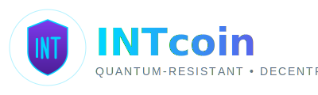

# INTcoin Brand Guidelines

**Copyright (c) 2025 INTcoin Core (Maddison Lane)**

**Version**: 1.0
**Last Updated**: January 2025

---

## 🎨 Brand Identity

INTcoin represents the future of cryptocurrency: **quantum-resistant, secure, and decentralized**. Our visual identity reflects these core values through modern, tech-forward design that communicates trust, innovation, and resilience.

---

## Logo Design

### Concept

The INTcoin logo features a **quantum shield** - symbolizing protection against quantum computing threats - with the **INT monogram** at its center.

**Design Elements**:
- **Shield**: Represents security and protection
- **Quantum Rings**: Orbital elements symbolizing quantum mechanics
- **Lattice Pattern**: References lattice-based cryptography (Dilithium, Kyber)
- **INT Monogram**: Clean, modern letterforms
- **Energy Gradient**: Represents the dynamic, forward-thinking nature

### Logo Variations

1. **Primary Logo** ([logo.svg](logo.svg))
   - Full shield with quantum effects
   - Use: App icons, social media, primary branding
   - Size: 200x200px (square)

2. **Horizontal Logo** ([logo-horizontal.svg](logo-horizontal.svg))
   - Shield + wordmark + tagline
   - Use: Website headers, presentations, documentation
   - Size: 400x120px

3. **Monochrome** (to be created)
   - Single color versions for special use cases
   - White on dark, dark on light

### Clear Space

Maintain a clear space around the logo equal to the height of the "I" in "INT" to ensure visibility and impact.

### Minimum Size

- Digital: 32px minimum height
- Print: 0.5 inches minimum height

---

## 🎨 Color Palette

### Primary Colors

#### Quantum Blue
- **HEX**: `#00d4ff`
- **RGB**: `0, 212, 255`
- **Use**: Primary accent, links, highlights, quantum effects
- **Meaning**: Innovation, technology, trust

#### Deep Purple
- **HEX**: `#7c3aed`
- **RGB**: `124, 58, 237`
- **Use**: Secondary accent, gradients, shields
- **Meaning**: Security, sophistication, quantum computing

#### Dark Purple
- **HEX**: `#4c1d95`
- **RGB**: `76, 29, 149`
- **Use**: Dark accents, shadows, depth
- **Meaning**: Strength, reliability

### Secondary Colors

#### Electric Cyan
- **HEX**: `#0084ff`
- **RGB**: `0, 132, 255`
- **Use**: Gradient midpoints, interactive elements

#### Violet
- **HEX**: `#6b4ce6`
- **RGB**: `107, 76, 230`
- **Use**: Gradient endpoints, decorative elements

### Neutral Colors

#### Slate Gray (Text)
- **HEX**: `#64748b`
- **RGB**: `100, 116, 139`
- **Use**: Body text, secondary information

#### Dark Slate (Headings)
- **HEX**: `#1e293b`
- **RGB**: `30, 41, 59`
- **Use**: Headings, important text

#### Light Gray (Backgrounds)
- **HEX**: `#f8fafc`
- **RGB**: `248, 250, 252`
- **Use**: Light backgrounds, cards

#### White
- **HEX**: `#ffffff`
- **RGB**: `255, 255, 255`
- **Use**: Primary backgrounds, text on dark

#### Dark (Backgrounds)
- **HEX**: `#0f172a`
- **RGB**: `15, 23, 42`
- **Use**: Dark mode backgrounds

### Gradients

#### Primary Gradient (Quantum Energy)
```css
background: linear-gradient(135deg, #00d4ff 0%, #0084ff 50%, #6b4ce6 100%);
```

#### Shield Gradient
```css
background: linear-gradient(180deg, #7c3aed 0%, #4c1d95 100%);
```

---

## 📝 Typography

### Primary Font: **Inter** (or Arial/Helvetica as fallback)

**Headings**:
- Font Weight: 700-900 (Bold to Black)
- Use: All headings, important UI elements

**Body Text**:
- Font Weight: 400-500 (Regular to Medium)
- Use: Paragraphs, descriptions

**Code/Technical**:
- Font: **JetBrains Mono** or **Fira Code**
- Use: Code blocks, addresses, hashes

### Font Sizes

```css
/* Headings */
H1: 48px / 3rem    (Extra Bold, 900)
H2: 36px / 2.25rem (Bold, 700)
H3: 28px / 1.75rem (Bold, 700)
H4: 24px / 1.5rem  (Semi-Bold, 600)
H5: 20px / 1.25rem (Medium, 500)

/* Body */
Large:  18px / 1.125rem
Normal: 16px / 1rem
Small:  14px / 0.875rem
Tiny:   12px / 0.75rem
```

---

## 🎭 Visual Style

### Design Principles

1. **Modern & Clean**: Minimalist design with purpose
2. **Tech-Forward**: Embrace futuristic, digital aesthetics
3. **Trustworthy**: Professional, reliable visual language
4. **Accessible**: High contrast, readable, WCAG compliant

### UI Elements

#### Buttons

**Primary Button**:
```css
background: linear-gradient(135deg, #00d4ff, #6b4ce6);
color: white;
padding: 12px 24px;
border-radius: 8px;
font-weight: 600;
```

**Secondary Button**:
```css
background: transparent;
border: 2px solid #00d4ff;
color: #00d4ff;
padding: 12px 24px;
border-radius: 8px;
```

#### Cards

```css
background: white;
border: 1px solid #e2e8f0;
border-radius: 12px;
box-shadow: 0 4px 6px rgba(0, 0, 0, 0.05);
padding: 24px;
```

#### Glow Effects

Use for quantum/energy effects:
```css
box-shadow: 0 0 20px rgba(0, 212, 255, 0.3);
```

---

## 🖼️ Imagery Style

### Photography

- **Subject**: Technology, security, networks, abstract digital art
- **Style**: High-tech, clean, professional
- **Colors**: Cool tones (blues, purples) to match brand
- **Mood**: Confident, forward-thinking, secure

### Illustrations

- **Style**: Geometric, minimal, line-art
- **Themes**: Quantum particles, shields, networks, lattices
- **Colors**: Use brand color palette
- **Complexity**: Simple and clear, not cluttered

### Icons

- **Style**: Outline or filled, consistent stroke width
- **Size**: 24px standard (scalable)
- **Library**: Heroicons, Feather Icons, or custom
- **Color**: Quantum Blue (#00d4ff) or match context

---

## 🌐 Web Design

### Layout

- **Maximum Width**: 1280px for content
- **Grid**: 12-column responsive grid
- **Spacing**: 8px base unit (8, 16, 24, 32, 48, 64px)
- **Border Radius**: 8px for small, 12px for medium, 16px for large

### Dark Mode

INTcoin supports both light and dark themes:

**Dark Mode Colors**:
- Background: `#0f172a`
- Card Background: `#1e293b`
- Text: `#f8fafc`
- Accents: Same (Quantum Blue, Deep Purple)

### Animations

Use subtle animations for:
- Hover states (0.2s ease)
- Page transitions (0.3s ease-in-out)
- Loading states (smooth)
- Quantum effects (slow rotation, 20s)

**Example**:
```css
transition: all 0.2s ease;

/* Quantum ring rotation */
@keyframes rotate {
  from { transform: rotate(0deg); }
  to { transform: rotate(360deg); }
}
animation: rotate 20s linear infinite;
```

---

## 📱 Application Design

### Wallet UI

**Key Principles**:
- **Security First**: Clear warnings, confirmations
- **Clarity**: Show amounts, addresses clearly
- **Simplicity**: Minimize steps for common tasks

**Themes**:
- Light theme (default)
- Dark theme (optional)

### Desktop App

- Native window decorations or frameless with custom title bar
- Resizable, minimum 800x600px
- Sidebar navigation
- Main content area
- Status bar at bottom

---

## 🎯 Brand Voice

### Tone

- **Professional**: Expert but approachable
- **Confident**: Sure of technology and vision
- **Educational**: Explain quantum resistance clearly
- **Inclusive**: Crypto for everyone, not just experts

### Messaging

**Taglines**:
- "Quantum-Resistant • Decentralized"
- "The Future of Secure Currency"
- "Built for the Quantum Era"
- "True Decentralization, Quantum-Safe"

**Key Messages**:
1. INTcoin is quantum-resistant (Dilithium, Kyber)
2. ASIC-resistant mining keeps it decentralized
3. Privacy-focused (pseudonymous)
4. No staking, no governance - pure PoW
5. Lightning Network for fast payments

---

## ✅ Do's and Don'ts

### ✅ Do

- Use official logos and colors
- Maintain clear space around logos
- Use high-contrast color combinations
- Scale logos proportionally
- Use approved fonts
- Follow accessibility guidelines

### ❌ Don't

- Distort or rotate the logo
- Change logo colors arbitrarily
- Add effects to logos (except approved glow)
- Use low-resolution logos
- Combine with other brand elements
- Use unapproved fonts for official materials

---

## 📦 Asset Files

### Logos

- `logo.svg` - Primary square logo
- `logo-horizontal.svg` - Horizontal logo with text
- `logo-white.svg` - White version (to be created)
- `logo-black.svg` - Black version (to be created)
- `favicon.ico` - Website favicon (to be created)

### Export Formats

For each logo:
- SVG (vector, preferred)
- PNG (transparent, 1x, 2x, 3x)
- WebP (for web optimization)

### Sizes

**Square Logo**:
- 16x16 (favicon)
- 32x32 (small icon)
- 64x64 (icon)
- 128x128 (app icon)
- 256x256 (high-res icon)
- 512x512 (retina icon)
- 1024x1024 (master)

**Horizontal Logo**:
- 400x120 (standard)
- 800x240 (2x)
- 1200x360 (3x)

---

## 🔗 Usage Examples

### Website Header

```html
<header>
  
</header>
```

### Social Media

- **Profile Picture**: logo.svg (square)
- **Cover Image**: Custom design with logo + tagline
- **Posts**: Use brand colors and imagery

### Documentation

- Use horizontal logo at top
- Use brand colors for code blocks
- Include quantum particle graphics as accents

---

## 📞 Contact

For brand assets or usage questions:

**Email**: team@international-coin.org
**Website**: https://international-coin.org
**Repository**: https://gitlab.com/intcoin/crypto

---

## 📜 License

INTcoin branding and logos are © 2025 INTcoin Core (Maddison Lane).

**Usage**: Free to use for INTcoin-related projects and promotions. Do not use to imply official endorsement without permission.

---

**Version**: 1.0
**Last Updated**: January 2025
**Next Review**: June 2025
